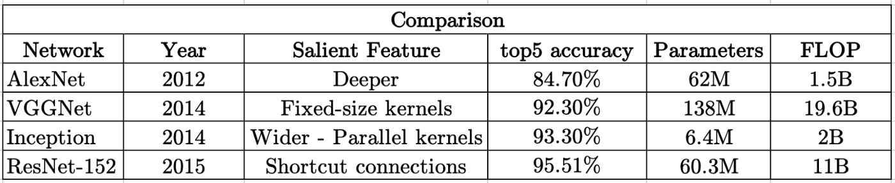
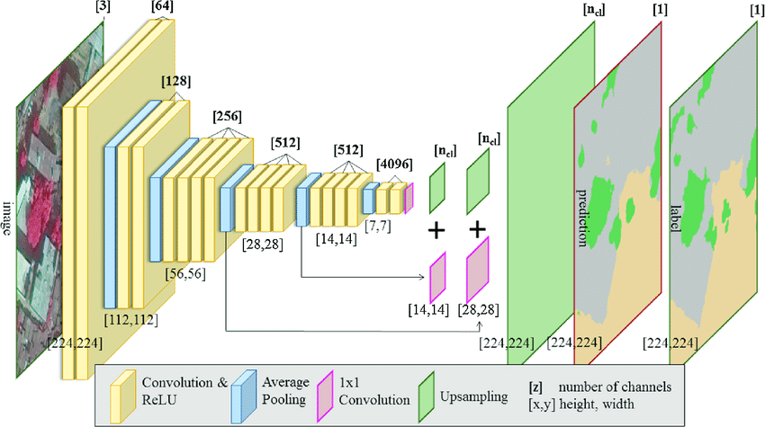
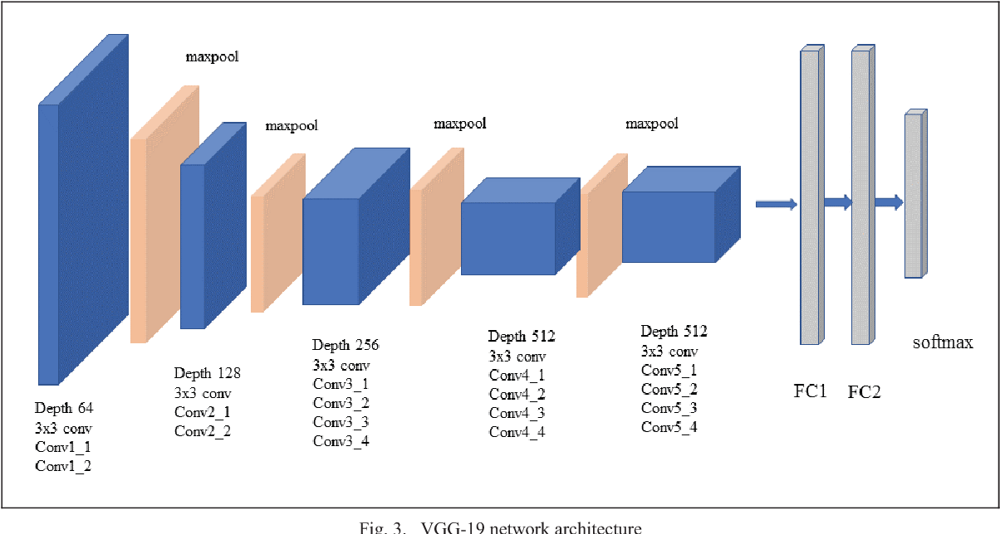

# Deploying_imagenet_pretrained_models_as_flask_web_service

This repository mainly focuses on deployment of imagenet model which was trained on VGG-19 architecture using Flask as a web service.
ImageNet is a huge collection of image database with more than 14 million images of more than thousand unique classes. AI researcher Fei-Fei Li began working on the idea for ImageNet in 2006. At a time when most AI research focused on models and algorithms, Li wanted to expand and improve the data available to train AI algorithms. Imagenet dataset was collected in collaborative research from Standford and Princeton University professors and students.

## How ImageNet Dataset was created?

Here is a link to the video of one of the researcher Fei-Fei-Li where she explains about the idea behind the creation of imagenet dataset and how it got created.

https://www.youtube.com/watch?v=40riCqvRoMs

## History Of Imagenet Challenge

AlexNet was born out of the need to improve the results of the ImageNet challenge. This was one of the first Deep convolutional networks to achieve considerable accuracy on the 2012 ImageNet LSVRC-2012 challenge with an accuracy of 84.7% as compared to the second-best with an accuracy of 73.8%.

In 2014,a successor of AlexNet VGGNet was created by Visual Geometry Group at OxFord's and hence the name VGG. VGGNet was the runner up of the ImageNet Large Scale Visual Recognition Challenge(ILSVRC) classification the benchmark in 2014 with just 7.3% error rate in the ILSVRC challenge.

In 2015,Inception-v3 with 144 crops and 4 models ensembled, the top-5 error rate of 3.58% is obtained, and finally obtained 1st Runner Up (image classification) in ILSVRC 2015.

In 2015,ResNet secured 1st Position in ILSVRC and COCO 2015 competition with just error rate of 3.6% of error rate. (Better than Human Performance !!!)

## Comparision Chart On the SOTA Architectures On ImageNet Challenge

But in this repository we have used the pretrained weights of VGG-19 architeture.VGGNET has two variants.VGG-16 and VGG-19. VGG-16 is 16 layers deep with 13 convolution layers and 3 fully connected layers but VGG-19 is 19 layers deep with 16 convolution layers and 3 fully connected layers.

## Architecture Of VGGNET:

    

Firstly, I run my notebook in google colab to download the VGG-19 pretrained model and then I save the model weights in .h5 file format.
